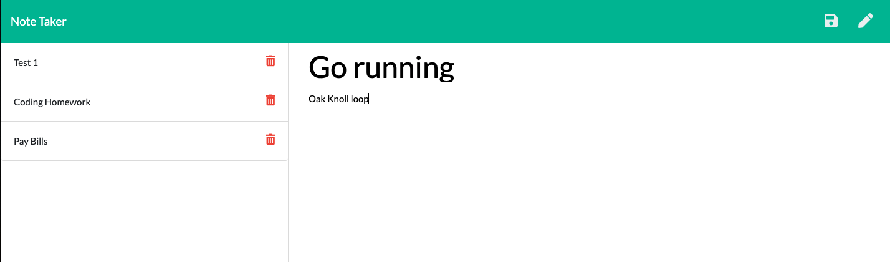

# Note Taker

## Table of Contents
* [Description](#Description)
* [Screenshot](#Screenshot)
* [Features](#Features)
* [Installation](#Installation)
* [Usage](#Usage)
* [LICENSE](#LICENSE)
* [CONTRIBUTING](#CONTRIBUTING)
* [Questions](#Questions)

## Description
This project will help you generate a professional README file in markdown format using node and your Command Line Interface.

## Screenshot

## Features
Utilizes javascript, node, npm, express, and to help you record your notes and share them with others.

## Installation
Clone this project from GitHub to your local machine.

To install dependencies, run the following in your Command Line Interface (e.g., Terminal or Bash):
- npm init
- npm install express

## Usage
Then run the following command:
- npm start

Demo version available after 'npm start' at https://guarded-forest-01938.herokuapp.com/

Or you can check your local version at http://localhost:3001/

## LICENSE
This repository is licensed under the 'Apache License 2.0'.
Refer to https://opensource.org/licenses/Apache-2.0 for complete license terms.

## CONTRIBUTING
This project is not accepting contributions but if you send a pull request, it could be accepted under the terms of the Apache 2.0 license.

## Credits
Significant collaborators to this project are (or will be) listed here.

hlry is the initial project author.

## Questions

If you have questions contact me on GitHub at [hlry](https://github.com/hlry).